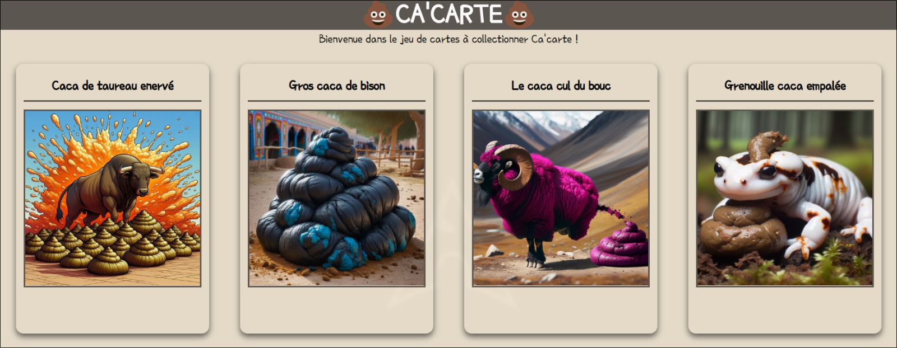
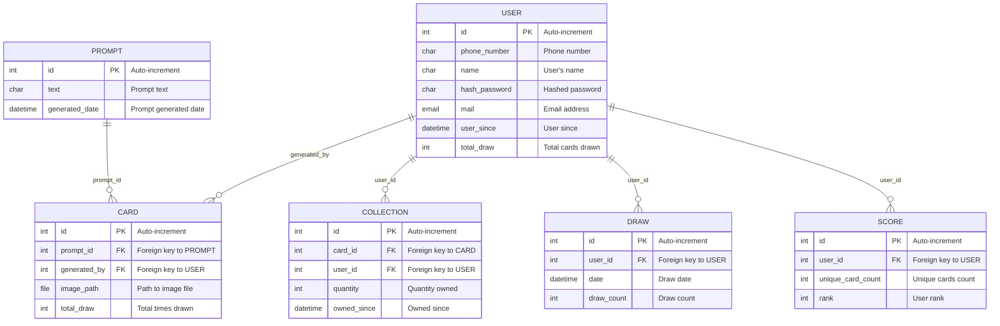

# 💩 AI-Generated Collectible Poop Card Game 💩


## 🚽 What's the Scoop?
Welcome to the ultimate throne room where AI and humor collide to create the most unforgettable, collectible Poop card game. Flush your boredom away as you collect and compete with cards that are as unique as... well, bowel movements.

## 🧻 Features
- **Daily Dumps**: Your chance to snag new Poop cards each morning.
- **AI-Powered Plops**: Each card is a steaming fresh AI-generated masterpiece.
- **Texts from the Toilet**: Get SMS notifications when it's time to expand your collection.
- **Sturdy Plumbing with Django MVC**: A rock-solid web platform that won't clog.
- **Secure Stalls**: Phone number authentication to keep your collection private.
- **Gallery of Gallantry**: Admire your complete Poop card collection.
- **Poop Card Crafting**: Images are shaped into the finest collectible cards.
- **Leaderboard of Legends**: Climb the ranks and become the ultimate Poop collector.
- **Dockerized Doodie Deployment**: Containers for clean and easy setup.

## 🧼 Getting Your Hands Dirty

### Prerequisites
- Python 3.x
- Django
- Docker
- MariaDB
- NPM
- Twilio or another SMS gateway for those important Poop calls

### 🛁 Installation
1. **Clone this Throne**:
   ```bash
   git clone https://github.com/Ptitlu42/PoopProject.git
   ```
2. **Dive into the Sewer**:
   ```bash
   cd PoopProject
   ```
3. **Summon the Sewage System**:
   ```bash
   npm install
   ```
   ```bash
   docker-compose up --build
   ```
4. **Lay the Pipes**:
   ```bash
   docker-compose exec web python manage.py migrate
   ```
5. **Crown the Porcelain God**:
   ```bash
   npm start
   ```
- **Visit the Latrine** at `http://localhost:8000/welcome`.
- **Commence the Collection**: Follow the instructions to collect and cherish your Poop cards.

## ⚙️ Configuration
- **Set Your Toilet Paper Preferences**: Customize your `.env` file with the necessary configurations for your SMS gateway and database access.

## 🤝 Contributing
Feel like dropping a contribution? Fork the repository and unload your pull requests!

## 📜 License
This Poop creation is released into the public sewer under the [MIT License](LICENSE).

## 🙌 Acknowledgements
- Big shout-out to the wizards at OpenAI for providing the AI that generates our fabulous fecal friends.
- Generated images are subject to OpenAI's usage policies and terms, so handle them like you would... precious poop.

## ✉️ Contact
For any issues that stink up the place or golden nuggets of feedback, drop us a line at [P'tit Lu](mailto:lucas.beyer@gmx.fr).

